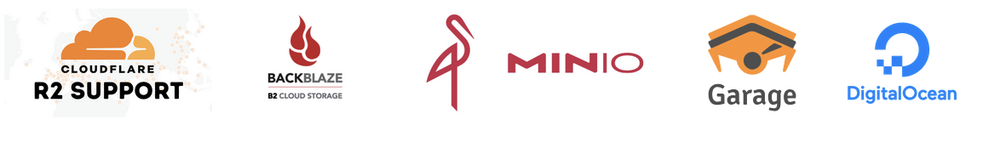

# s3mini | Tiny & fast S3 client for node and edge platforms.

`s3mini` is an ultra-lightweight Typescript client (~14 KB minified, ≈15 % more ops/s) for S3-compatible object storage. It runs on Node, Bun, Cloudflare Workers, and other edge platforms. It has been tested on Cloudflare R2, Backblaze B2, DigitalOcean Spaces, and MinIO. (No Browser support!)

[[github](https://github.com/good-lly/s3mini)]
[[issues](https://github.com/good-lly/s3mini/issues)]
[[npm](https://www.npmjs.com/package/s3mini)]

## Features

- 🚀 Light and fast: averages ≈15 % more ops/s and only ~14 KB (minified, not gzipped).
- 🔧 Zero dependencies; supports AWS SigV4 (no pre-signed requests).
- 🟠 Works on Cloudflare Workers; ideal for edge computing, Node, and Bun (no browser support).
- 🔑 Only the essential S3 APIs—improved list, put, get, delete, and a few more.
- 📦 **BYOS3** — _Bring your own S3-compatible bucket_ (tested on Cloudflare R2, Backblaze B2, DigitalOcean Spaces, MinIO and Garage! Ceph and AWS are in the queue).

#### Tested On



Dev:


[](https://github.com/good-lly/s3mini/actions/workflows/codeql.yml)
[](https://github.com/good-lly/s3mini/actions/workflows/test-e2e.yml)


<a href="https://github.com/good-lly/s3mini/issues/"> </a>

Performance tests was done on local Minio instance. Your results may vary depending on environment and network conditions, so take it with a grain of salt.


## Table of Contents

- [Supported Ops](#supported-ops)
- [Installation](#installation)
- [Usage](#usage)
- [Security Notes](#security-notes)
- [💙 Contributions welcomed!](#contributions-welcomed)
- [License](#license)

## Supported Ops

The library supports a subset of S3 operations, focusing on essential features, making it suitable for environments with limited resources.

#### Bucket ops

- ✅ HeadBucket (bucketExists)
- ✅ createBucket (createBucket)

#### Objects ops

- ✅ ListObjectsV2 (listObjects)
- ✅ GetObject (getObject, getObjectResponse, getObjectWithETag, getObjectRaw, getObjectArrayBuffer, getObjectJSON)
- ✅ PutObject (putObject)
- ✅ DeleteObject (deleteObject)
- ✅ HeadObject (objectExists, getEtag, getContentLength)
- ✅ listMultipartUploads
- ✅ CreateMultipartUpload (getMultipartUploadId)
- ✅ completeMultipartUpload
- ✅ abortMultipartUpload
- ✅ uploadPart
- ❌ CopyObject: Not implemented (tbd)

## Installation

```bash
npm install s3mini
```

```bash
yarn add s3mini
```

```bash
pnpm add s3mini
```

> **⚠️ Environment Support Notice**
>
> This library is designed to run in environments like **Node.js**, **Bun**, and **Cloudflare Workers**. It does **not support browser environments** due to the use of Node.js APIs and polyfills.
>
> **Cloudflare Workers:** To enable built-in Node.js Crypto API, add the `nodejs_compat` compatibility flag to your Wrangler configuration file. This also enables `nodejs_compat_v2` as long as your compatibility date is `2024-09-23` or later. [Learn more about the Node.js compatibility flag and v2](https://developers.cloudflare.com/workers/configuration/compatibility-dates/#nodejs-compatibility-flag).

## Usage

```typescript
import { s3mini, sanitizeETag } from 's3mini';

const s3client = new s3mini({
  accessKeyId: config.accessKeyId,
  secretAccessKey: config.secretAccessKey,
  endpoint: config.endpoint,
  region: config.region,
});

// Basic bucket ops
let exists: boolean = false;
try {
  // Check if the bucket exists
  exists = await s3client.bucketExists();
} catch (err) {
  throw new Error(`Failed bucketExists() call, wrong credentials maybe: ${err.message}`);
}
if (!exists) {
  // Create the bucket based on the endpoint bucket name
  await s3client.createBucket();
}

// Basic object ops
// key is the name of the object in the bucket
const smallObjectKey: string = 'small-object.txt';
// content is the data you want to store in the object
// it can be a string or Buffer (recommended for large objects)
const smallObjectContent: string = 'Hello, world!';

// check if the object exists
const objectExists: boolean = await s3client.objectExists(smallObjectKey);
let etag: string | null = null;
if (!objectExists) {
  // put/upload the object, content can be a string or Buffer
  // to add object into "folder", use "folder/filename.txt" as key
  const resp: Response = await s3client.putObject(smallObjectKey, smallObjectContent);
  // you can also get etag via getEtag method
  // const etag: string = await s3client.getEtag(smallObjectKey);
  etag = sanitizeETag(resp.headers.get('etag'));
}

// get the object, null if not found
const objectData: string | null = await s3client.getObject(smallObjectKey);
console.log('Object data:', objectData);

// get the object with ETag, null if not found
const response2: Response = await s3mini.getObject(smallObjectKey, { 'if-none-match': etag });
if (response2) {
  // ETag changed so we can get the object data and new ETag
  // Note: ETag is not guaranteed to be the same as the MD5 hash of the object
  // ETag is sanitized to remove quotes
  const etag2: string = sanitizeETag(response2.headers.get('etag'));
  console.log('Object data with ETag:', response2.body, 'ETag:', etag2);
} else {
  console.log('Object not found or ETag does match.');
}

// list objects in the bucket, null if bucket is empty
// Note: listObjects uses listObjectsV2 API and iterate over all pages
// so it will return all objects in the bucket which can take a while
// If you want to limit the number of objects returned, use the maxKeys option
// If you want to list objects in a specific "folder", use "folder/" as prefix
// Example s3client.listObjects({"/" "myfolder/"})
const list: object[] | null = await s3client.listObjects();
if (list) {
  console.log('List of objects:', list);
} else {
  console.log('No objects found in the bucket.');
}

// delete the object
const wasDeleted: boolean = await s3client.deleteObject(smallObjectKey);

// Multipart upload
const multipartKey = 'multipart-object.txt';
const large_buffer = new Uint8Array(1024 * 1024 * 15); // 15 MB buffer
const partSize = 8 * 1024 * 1024; // 8 MB
const totalParts = Math.ceil(large_buffer.length / partSize);
// Beware! This will return always a new uploadId
// if you want to use the same uploadId, you need to store it somewhere
const uploadId = await s3client.getMultipartUploadId(multipartKey);
const uploadPromises = [];
for (let i = 0; i < totalParts; i++) {
  const partBuffer = large_buffer.subarray(i * partSize, (i + 1) * partSize);
  // upload each part
  // Note: uploadPart returns a promise, so you can use Promise.all to upload all parts in parallel
  // but be careful with the number of parallel uploads, it can cause throttling
  // or errors if you upload too many parts at once
  // You can also use generator functions to upload parts in batches
  uploadPromises.push(s3client.uploadPart(multipartKey, uploadId, partBuffer, i + 1));
}
const uploadResponses = await Promise.all(uploadPromises);
const parts = uploadResponses.map((response, index) => ({
  partNumber: index + 1,
  etag: response.etag,
}));
// Complete the multipart upload
const completeResponse = await s3client.completeMultipartUpload(multipartKey, uploadId, parts);
const completeEtag = completeResponse.etag;

// List multipart uploads
// returns object with uploadId and key
const multipartUploads: object = await s3client.listMultipartUploads();
// Abort the multipart upload
const abortResponse = await s3client.abortMultipartUpload(multipartUploads.key, multipartUploads.uploadId);

// Multipart download
// lets test getObjectRaw with range
const rangeStart = 2048 * 1024; // 2 MB
const rangeEnd = 8 * 1024 * 1024 * 2; // 16 MB
const rangeResponse = await s3client.getObjectRaw(multipartKey, false, rangeStart, rangeEnd);
const rangeData = await rangeResponse.arrayBuffer();
```

For more check [USAGE.md](USAGE.md) file, examples and tests.

## Test Setup & Environment Variables

- To run tests, you must set environment variables for each provider, e.g.:
  - `BUCKET_ENV_MINIO=provider,accessKey,secret,endpoint,region`
  - `BUCKET_ENV_CLOUDFLARE=...` (see `.github/workflows/test-e2e.yml` for examples)
- If these are not set, tests will be skipped. For local development, you can add mock values or use the new mock mode (see below).

## Mock/Fallback Test Mode

- If no environment variables are set, tests will run in mock mode and only basic logic/unit tests will execute.

## Deprecated Dependencies

- Some dependencies (e.g., `inflight`, `glob`) are deprecated. Consider updating them in future releases.

## Unit Tests

- Added a basic unit test example in `tests/utils.unit.test.js`.

## Security Notes

- The library masks sensitive information (access keys, session tokens, etc.) when logging.
- Always protect your AWS credentials and avoid hard-coding them in your application (!!!). Use environment variables. Use environment variables or a secure vault for storing credentials.
- Ensure you have the necessary permissions to access the S3 bucket and perform operations.
- Be cautious when using multipart uploads, as they can incur additional costs if not managed properly.
- Authors are not responsible for any data loss or security breaches resulting from improper usage of the library.
- If you find a security vulnerability, please report it to us directly via email. For more details, please refer to the [SECURITY.md](SECURITY.md) file.

## Contributions welcomed!

Contributions are greatly appreciated! If you have an idea for a new feature or have found a bug, we encourage you to get involved:

- _Report Issues_: If you encounter a problem or have a feature request, please open an issue on GitHub. Include as much detail as possible (environment, error messages, logs, steps to reproduce, etc.) so we can understand and address the issue.

- _Pull Requests_: We welcome PRs! If you want to implement a new feature or fix a bug, feel free to submit a pull request to the latest `dev branch`. For major changes, it's a good idea to discuss your plans in an issue first.

- _Lightweight Philosophy_: When contributing, keep in mind that s3mini aims to remain lightweight and dependency-free. Please avoid adding heavy dependencies. New features should provide significant value to justify any increase in size.

- _Community Conduct_: Be respectful and constructive in communications. We want a welcoming environment for all contributors. For more details, please refer to our [CODE_OF_CONDUCT.md](CODE_OF_CONDUCT.md). No one reads it, but it's there for a reason.

If you figure out a solution to your question or problem on your own, please consider posting the answer or closing the issue with an explanation. It could help the next person who runs into the same thing!

## License

This project is licensed under the MIT License - see the [LICENSE.md](LICENSE.md) file for details.

## Sponsor This Project

Developing and maintaining s3mini (and other open-source projects) requires time and effort. If you find this library useful, please consider sponsoring its development. Your support helps ensure I can continue improving s3mini and other projects. Thank you!

[](https://github.com/sponsors/good-lly)
